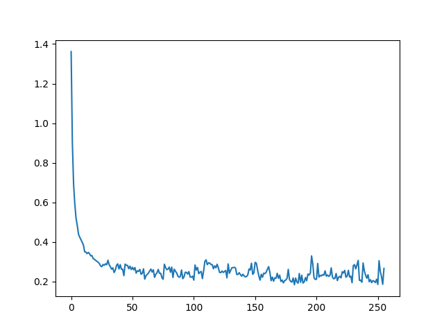

# About

The aim of this application is to detect based on a stream of data if there are present any military forces. Due to the events that are happening in Ukraine, this could be a good tool in identifying enemy forces either inside the cities with surveillance cameras or outside with satellite images or drones.

In the current implementation, you can select to use either a video format o an image to check the results of the application.

# Current Progress

## Implemented
    * Face recognition using RetinaFace -> Persons detection
    * Image normalization
    * CNN for detecting if the person is a military or not

## Attempted but failed
    * Human detection using HOG Descriptor
    * Human detection using DeepFace

# Project Structure

## Subfolders

    - models: location for saving the brain of the ml_model
    - saves: location for saving the predictions made by the ml_model
    - training_dataset_personnel: location for the training of the MilitaryPersonnelModel
    - tests: location of simple images that can be tested in the application
    - utils: location for Video and Image reader classes
    - ml_model: location of the class file for MilitaryPersonnelModel
    - face_detector: location of the class files for face recognition (HOG and RetinaFace)

# Modules

## VideoCapture module

The aim of this module is to convert a video into frames.

### Required parameters

video_path: a path for the video file
frames_no: the number of frames that will be taken for every occurrence (1 for native framerate, 10 for example to take
every 10 frames into account)

### Functions

update_video_path: update the current path of the video
update_frames_no: update the current number of frame occurrences
read_by_frame: take from the video each frame based on the number of occurrences set and return a list of all the frames

## ImageReader

The aim of this module is to read an image from a path.

### Required parameters

image_path: a path for the image

### Functions

update_image_path: update the current path of the image
read_by_image: read the image and return it

## RetinaFace_HumanDetection

The aim of this module is to detect human faces from an input, compute and crop based on the size of their head, and the whole body.

### Functions

part_normalize: function designed to lightly blur the image given and make it gray. returns the result
detect_by_video: function designed to detect all faces from a given list of frames, and return a list of them
detect_by_image: function designed to detect all faces from an image, and return a list of them

## MilitaryPersonnelModel module

### Functions

normalize: normalizes a given image and returns the results
create_model: creates an ML model and returns it
gather_training_data: from the data-training folder, gets all the data and categorizes it with the answers. returns a tuple of images - (0/1 for non-military/military)
train_and_save: based on the generated model and dataset, train the model, save the brain, and plot the loss
evaluate_frames: based on a saved brain, parse a list of people from a video and save them to the corresponding folders based on the prediction made
evaluate_image: based on a saved brain, parse a list of people from an image and save them to the corresponding folders based on the prediction made

# ML Results

Using a CNN approach, after training the MilitaryPersonnelModel I have achieved an accuracy of 83%. I do not believe this to be the best this model can do nor that the current setup contains the "golden values". With much more time invested, I am confident that the accuracy can increase to 90% - 95%.

Here is the loss graph for the current values:

# Hacksaw Ridge Test

After building this application I decided that I should give it a big test. I am a big fan of the "Hacksaw Ridge" movie, so I decided to use it as input for the application.

## Specs of my computer

CPU: i5-9400f
GPU: GTX 1660
RAM: 32GB 2666 mhz

## Runtime

Because I've done all of the training on my personal computer, the time it took to process the movie was quite large, estimating 1 hour to get all the frames from the movie and detect the persons in it + 10 minutes (at the very most) to predict everything.

## Results 

In the end, the accuracy of this test was around 87%, a bit higher than the training results. One aspect that is worth mentioning is the fact that no footage from this movie has been used in training. Personally, I am very pleased with these results.

You can check those results as well in the ZIP file that is uploaded to this git repository.

# Requirements

In order to be able to run this project you need to have Python 3.10+ and a GPU.

# Setup

1. Download the repository: `git clone https://github.com/LCCosmin/MilitaryDetectionModel.git`
2. Create a new environment: `python3 -m venv <name_of_the_virtualenv>`
3. Activate the environment: `source <name_of_the_virtualenv>/bin/activate`
4. Install requirements.txt: `pip install -r requirements.txt`
5. Make adjustments in main.py based on what you want to do.
6. Run main.py: `python3 main.py`
